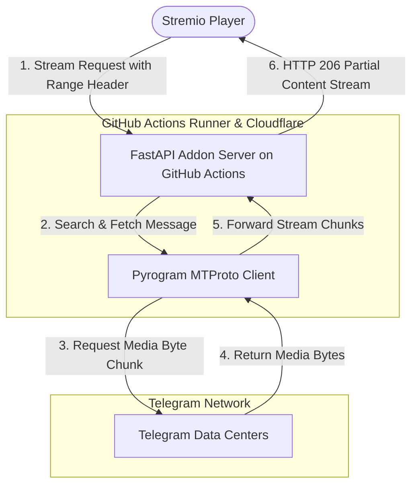

# Telegram Stremio Addon


[](LICENSE)
[](https://github.com/features/actions)
[](https://www.cloudflare.com/products/tunnel/)

Stream video, audio, and subtitle files directly from your private Telegram storage channels inside **Stremio**. This addon operates as a high-speed on-the-fly streaming HTTP proxy (fully supporting HTTP 206 Range Requests for instant seek/scrubbing) that integrates your private Telegram channel into your personal Stremio library.

---

## ⚡ Why Host on GitHub Actions?

Hosting directly on GitHub Actions offers the best free hosting experience for your personal Telegram Stremio addon:

* **100% Free**: Unlimited runner minutes for public GitHub repositories with zero credit card required.
* **Fast Streaming**: High-speed Gigabit networking powered by Microsoft Azure data centers with C-based `tgcrypto` encryption.
* **Generous Resources**: 2 vCPU and 7 GB RAM dedicated per runner instance.
* **24/7 Continuous Uptime**: Automatic scheduled workflow (`cron: '0 */5 * * *'`) starts a fresh runner cycle every 5 hours before GitHub Actions' 6-hour job timeout.
* **Automatic Secure HTTPS**: Powered by Cloudflare Tunnel (`cloudflared`), giving you instant HTTPS access with zero port-forwarding or domain setup required.

---

## 🚀 Complete Step-by-Step GitHub Hosting Guide

Follow these simple steps to deploy your addon 24/7 in less than 5 minutes:

### Step 1: Fork or Clone This Repository
Click the **Fork** button at the top-right of this repository to create your own copy on GitHub.

---

### Step 2: Get Your Telegram API Credentials
1. Go to **[my.telegram.org](https://my.telegram.org)** and log in with your phone number.
2. Click **API development tools**.
3. Create a new application (you can enter any app title and short name).
4. Copy your **`API_ID`** (a number) and **`API_HASH`** (a 32-character string).

---

### Step 3: Generate Your Pyrogram `USER_SESSION_STRING`

A User Session String lets the addon stream files up to **4 GB** (bypassing the 2 GB bot limit).

> [!CAUTION]
> **Never commit your session string to public files.** Only store it in GitHub Repository Secrets (Step 4).

Choose the easiest method below to generate your session string:

#### Option A: Run on Mobile (via Google Colab — No App Install Needed)
1. Open **[colab.new](https://colab.new)** in your mobile web browser (log in with Google).
2. Click **+ Code**, paste the code below, and press the **Play (▶)** button:
   ```python
   !pip install pyrogram tgcrypto
   import asyncio
   from pyrogram import Client
   api_id = int(input('API ID: '))
   api_hash = input('API HASH: ')
   async def main():
       async with Client('temp_session', api_id, api_hash) as app:
           print('\nYour USER_SESSION_STRING is:\n')
           print(await app.export_session_string())
   asyncio.run(main())
   ```
3. Enter your `API_ID`, `API_HASH`, phone number with country code (e.g. `+1234567890`), and the login code sent to your Telegram app.
4. Copy the generated `USER_SESSION_STRING`.

#### Option B: Run on Local PC (Terminal)
Run this one-liner in your terminal:
```bash
python3 -c "import asyncio; from pyrogram import Client; api_id = int(input('API ID: ')); api_hash = input('API HASH: '); asyncio.run(Client('temp_session', api_id, api_hash).export_session_string())"
```

---

### Step 4: Add GitHub Repository Secrets

1. Open your repository on GitHub.
2. Go to **⚙️ Settings** → **Secrets and variables** → **Actions**.
3. Click **New repository secret** and add the following:

| Secret Name | Required | Description | Example |
| :--- | :---: | :--- | :--- |
| `API_ID` | **Yes** | Telegram API ID from my.telegram.org | `12345678` |
| `API_HASH` | **Yes** | Telegram API Hash from my.telegram.org | `a1b2c3d4e5f6...` |
| `USER_SESSION_STRING` | **Yes** | Pyrogram Session String (from Step 3) | `1BJWX...` |
| `API_KEY` | **Optional** | Password to protect your addon from unauthorized use | `mysecretkey123` |
| `CF_WORKER_URL` | **Optional** | Your permanent Cloudflare Worker URL (see [Permanent URL Guide](#-how-to-get-a-permanent-addon-url)) | `https://stremio-gateway.yourname.workers.dev` |
| `CF_WORKER_SECRET` | **Optional** | Secret token for your Worker (defaults to `API_KEY`) | `mysecretkey123` |
| `CLOUDFLARE_TUNNEL_TOKEN` | **Optional** | Cloudflare Zero Trust Named Tunnel Token for fixed custom domains | `eyJh...` |
| `TELEGRAM_CHANNEL_ID` | **Optional** | Specific channel ID(s) to index (comma-separated) | `-1001234567890` |
| `LOG_CHANNEL_ID` | **Optional** | Channel ID to send playback activity logs | `-1009876543210` |

---

### Step 5: Start the Addon Workflow

1. In your GitHub repository, click the **Actions** tab at the top.
2. In the left sidebar under Workflows, click **Deploy Stremio**.
3. Click **Run workflow** → **Run workflow** (on branch `main`).
4. GitHub Actions will start your runner, connect to Telegram, and launch Cloudflare Tunnel.

---

### Step 6: Get Your Live Manifest URL & Install in Stremio

1. Click on the running **Deploy Stremio** workflow run.
2. Click **Summary** (or expand the **Start Server** step in the logs).
3. Copy your live URL:
   ```text
   https://<generated-tunnel-id>.trycloudflare.com/
   ```
4. **Install into Stremio**:
   * Open the URL above in your phone or PC web browser.
   * Enter your `API_KEY` (if configured) and click **Install on Stremio App** (or **Install on Stremio Web**).
   * Stremio will open and install your addon automatically!

---

## 🌐 How to Get a Permanent Addon URL

By default, the free Quick Tunnel creates a new URL every 5 hours when GitHub Actions restarts. You can easily set up a **Permanent URL** that **never changes** using either method below:

### 🌟 Method 1: Free Cloudflare Worker Gateway (No Domain Needed — Recommended)

Get a permanent, 100% free `*.workers.dev` URL without buying or owning a domain:

1. **Create a Worker in Cloudflare**:
   * Go to **[Cloudflare Dashboard](https://dash.cloudflare.com/)** → **Compute (Workers & Pages)** → **Create application** → **Create Worker**.
   * Choose **Start with Hello World!** → Name it `stremio-gateway` → Tap **Deploy**.
2. **Create KV Storage**:
   * In the left menu under **Workers & Pages**, tap **KV** → **Create a namespace** named `STREMIO_KV` → Tap **Add**.
3. **Bind KV to Your Worker**:
   * Go back to your Worker (`stremio-gateway`) → **Settings** tab → **Bindings** (or Variables & Secrets) → **Add binding**:
     * **Type:** `KV namespace`
     * **Variable name:** `STREMIO_KV`
     * **KV namespace:** `STREMIO_KV`
   * Tap **Save and Deploy**.
4. **Paste the 1-Line Gateway Code**:
   * Open your Worker page → Tap **Edit code** → Replace everything with this 1-line snippet and tap **Deploy**:
     ```javascript
     export default{async fetch(request,env){const url=new URL(request.url);if(url.pathname==="/__update_backend"&&request.method==="POST"){const auth=request.headers.get("Authorization")||"";if(!auth.includes(env.CF_WORKER_SECRET||"deep@2005"))return new Response("Unauthorized",{status:401});const data=await request.json();await env.STREMIO_KV.put("BACKEND",data.backend_url);return new Response(JSON.stringify({status:"ok"}),{headers:{"content-type":"application/json"}});}const backend=await env.STREMIO_KV.get("BACKEND");if(!backend)return new Response("Server starting up. Please wait 30 seconds.",{status:503});const target=new URL(url.pathname+url.search,backend);const headers=new Headers(request.headers);headers.set("X-Forwarded-Host",url.host);headers.set("X-Forwarded-Proto","https");return fetch(target.toString(),{method:request.method,headers:headers,body:request.body,redirect:"follow"});}};
     ```
5. **Add `CF_WORKER_URL` to GitHub Secrets**:
   * Go to your repository on GitHub → **Settings** → **Secrets and variables** → **Actions** → **New repository secret**:
     * **Name:** `CF_WORKER_URL`
     * **Value:** `https://stremio-gateway.yourname.workers.dev`
6. **Your Permanent Stremio URL**:
   ```text
   https://stremio-gateway.yourname.workers.dev/manifest.json?api_key=YOUR_API_KEY
   ```
   GitHub Actions will automatically sync with this Worker every 5 hours — your URL stays online and never changes!

---

### 🌐 Method 2: Cloudflare Zero Trust Named Tunnel (For Custom Domains)

If you own a custom domain on Cloudflare (e.g. `yourdomain.com`):

1. Go to **[Cloudflare Zero Trust](https://one.dash.cloudflare.com/)** → **Networks** → **Tunnels** → **Add a tunnel**.
2. Select **Cloudflared** → Name it `telegram-stremio` → Save.
3. Under **Install connector**, copy the token string (`eyJh...`).
4. Under **Public Hostname**, configure:
   * **Subdomain:** `stremio`
   * **Domain:** `yourdomain.com`
   * **Type:** `HTTP`
   * **URL:** `127.0.0.1:7860`
5. In GitHub Secrets, add:
   * **Name:** `CLOUDFLARE_TUNNEL_TOKEN`
   * **Value:** *(paste the `eyJh...` token)*
6. Your permanent URL will be:
   ```text
   https://stremio.yourdomain.com/manifest.json?api_key=YOUR_API_KEY
   ```

---

## 🔑 Key Features

* **Instant Search & Match**: Search any movie, anime, or series title in Stremio; the addon searches your Telegram channels and returns matching video streams instantly.
* **Stitched Split Streaming**: Automatically groups, merges, and streams multi-part file archives (such as `.001`, `.002`, `.part1.rar`, etc.) as one continuous virtual stream.
* **ZIP Archive Streaming**: Automatically scans, lists, and streams video files nested inside ZIP archives on the fly.
* **Subtitle Auto-Mapping**: Automatically detects and injects matching subtitle files (`.srt`, `.vtt`, `.ass`) with language tagging (English, Spanish, French, etc.).
* **HTTP 206 Range Requests**: Full byte-range seeking/scrubbing support for instant rewinding and fast-forwarding on ExoPlayer, VLC, and MPV.
* **Zero Storage Overhead**: Video bytes are streamed chunk-by-chunk directly from Telegram Data Centers to your media player without consuming local disk space.
* **Security & Access Control**: Protect your addon with an optional `API_KEY` to prevent unauthorized streaming.

---

## 📂 Naming and Matching Guide

To ensure the addon accurately matches your Telegram files with Stremio metadata, follow standard release naming conventions:

```text
[Title Name] [Season/Episode Info] [Quality/Extra Tags].mkv
```

### Examples:
* **Series**: `Naruto S01E02 [1080p] [Dual Audio].mkv`
* **Movies**: `Inception 2010 1080p BluRay.mkv`
* **Split Files**: `Avatar.2009.2160p.mkv.001`, `Avatar.2009.2160p.mkv.002`

---

## 🏗️ System Architecture



---

## ⚙️ Configuration Variables Reference

| Variable | Required | Description |
| :--- | :---: | :--- |
| `API_ID` | **Yes** | Your Telegram API ID from [my.telegram.org](https://my.telegram.org). |
| `API_HASH` | **Yes** | Your Telegram API Hash from [my.telegram.org](https://my.telegram.org). |
| `USER_SESSION_STRING` | **Yes** | Pyrogram Session String (allows streaming files up to 4GB). |
| `API_KEY` | No | Secret password of your choice to protect your addon endpoints (`?api_key=...`). |
| `CF_WORKER_URL` | No | Permanent Cloudflare Worker URL (`https://stremio-gateway.yourname.workers.dev`). |
| `CF_WORKER_SECRET` | No | Authorization secret for Cloudflare Worker sync (defaults to `API_KEY`). |
| `CLOUDFLARE_TUNNEL_TOKEN` | No | Cloudflare Zero Trust Named Tunnel Token for fixed custom domains. |
| `TELEGRAM_CHANNEL_ID` | No | Comma-separated list of channel IDs or usernames to index (`-1001234567890, @my_channel`). |
| `LOG_CHANNEL_ID` | No | Telegram channel ID where stream/playback logs are sent. |
| `CACHE_TTL` | No | Search cache duration in seconds (default: `1800` [30 mins]). |
| `TIMEZONE` | No | Timezone for logs (default: `UTC`). |

---

## 📜 License & Attribution

### MIT Non-Commercial License (MIT-NC)
This project is licensed under a custom **MIT Non-Commercial License (MIT-NC)**. Sublicensing, commercial distribution, renting, or monetization of this software or its derivatives is strictly prohibited. Attribution must be preserved in all copies.

### Disclaimer
This software is developed strictly for **educational, personal backup, and research purposes**. Users are solely responsible for the media files they access in their private Telegram storage channels.
